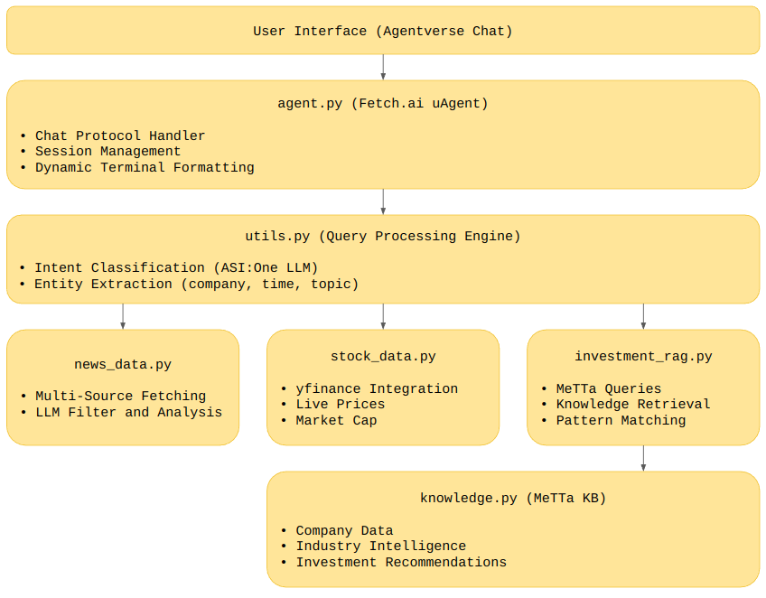

# Semiconductor Market Intelligence Agent

> **AI-Powered 24/7 Market Analysis with Automated Email Reports** | Integrating SingularityNET MeTTa Knowledge Graph & Fetch.ai uAgents


An autonomous AI agent that provides real-time semiconductor market analysis, combining intelligent news aggregation, live stock data, and structured knowledge reasoning to deliver institutional-grade investment insights. Features **automated email reports** and **volatility alerts** for 24/7 market monitoring.

## 🤖 Agent Details

- **Agent Name**: Semiconductor Market Intelligence Agent
- **Agent Address**: `agent1qddlqsx7ch8c5g6h600w0cexmw46777nrc74p7qu6mmt9zpfevjeyxhny58`
- **Category**: Innovation Lab
- **Hackathon**: ETH Global Online 2025

## 🚀 Quick Start

### **Prerequisites**

- Python 3.11+
- ASI:One API key ([Get it here](https://asi1.ai/))
- NewsAPI key ([Get it here](https://newsapi.org/)) - Optional
- Gmail account with App Password (for email notifications)

### **Installation**

```bash
# 1. Clone repository
git clone <your-repo-url>
cd project

# 2. Create virtual environment
python -m venv venv
source venv/bin/activate  # Linux/Mac
# Windows: venv\Scripts\activate

# 3. Install dependencies
pip install -r requirements.txt

# 4. Configure environment variables
cp .env.example .env
# Edit .env file with your credentials
```

### **📧 Email Service Configuration**

The agent includes a powerful email notification system that sends:
- **Hourly market reports** (every hour at :00)
- **Volatility alerts** (when stocks move >5%)
- **System startup notifications**

#### **Gmail Setup (Recommended)**

1. **Enable 2-Factor Authentication** on your Gmail account
2. **Generate App Password**:
   - Go to [Google Account Settings](https://myaccount.google.com/)
   - Security → 2-Step Verification → App passwords
   - Select "Mail" and "Other (Custom name)"
   - Name it "Semiconductor Agent"
   - Copy the 16-character password

3. **Configure .env file**:
```bash
# Required API Keys
ASI_ONE_API_KEY=your_asi_one_api_key_here
NEWS_API_KEY=your_news_api_key_here_optional

# Email Configuration
EMAIL_USER=your_email@gmail.com
EMAIL_PASSWORD=your_16_digit_app_password
RECIPIENT_EMAIL=recipient@example.com
SMTP_SERVER=smtp.gmail.com
SMTP_PORT=587
```

#### **Alternative Email Providers**

| Provider | SMTP Server | Port | Security |
|----------|-------------|------|----------|
| **Gmail** | smtp.gmail.com | 587 | TLS |
| **Outlook** | smtp-mail.outlook.com | 587 | TLS |
| **Yahoo** | smtp.mail.yahoo.com | 587 | TLS |
| **Custom** | your.smtp.server | 587/465 | TLS/SSL |

### **🎬 Run the Agent**

```bash
python agent.py
```

### **Expected Output**

```
🚀 SEMICONDUCTOR MARKET INTELLIGENCE AGENT
============================================================
🤖 Agent Name: Semiconductor Market Intelligence Agent
🌐 Agent Address: agent1qddlqsx7ch8c5g6h600w0cexmw46777nrc74p7qu6mmt9zpfevjeyxhny58
============================================================
📧 Email service: ✅ Configured
📨 Reports will be sent to: your_email@example.com
📮 Sending startup notification email...
✅ Startup notification email sent successfully!

📅 Starting scheduled task manager...
📅 Scheduled tasks configured:
   📊 Hourly market report: Every hour at :00
   🚨 Volatility monitoring: Every 15 minutes
🚀 Scheduled task manager started

✅ Agent startup complete!
💬 Ready to receive queries via Agentverse chat interface
============================================================
```

### **Connect to Agent**

1. **Via Agentverse Inspector**:
   - Copy the inspector URL from console
   - Click `Connect` → Select `Mailbox`
   - Follow [mailbox setup guide](https://innovationlab.fetch.ai/resources/docs/agent-creation/uagent-creation#mailbox-agents)

2. **Via Agentverse Chat**:
   - Go to `Agent Profile` → `Chat with Agent`
   - Start interacting through the web interface

### **Sample Queries**

#### 🎯 Multi-Intent Analysis
```
"Analyze TSMC stock price based on latest news"
"Should I invest in NVIDIA given recent developments?"
"What's happening with AMD and should I buy?"
"How do recent chip policy changes affect TSMC stock?"
```

#### 📈 Stock Price Tracking
```
"NVIDIA stock price"
"What's TSMC trading at?"
"Show me Broadcom price"
```

#### 📰 Real-Time News Intelligence
```
"What's the latest news about NVIDIA?"
"Tell me recent semiconductor news"
"What happened to TSMC this week?"
"Show me Intel developments from last month"
```

#### 🏢 Company Analysis
```
"Tell me about NVIDIA's market position"
"Analyze TSMC as an investment"
"Evaluate AMD's competitive position"
```

## ✨ Key Features

### 📧 **Automated Email Notifications**

The agent automatically sends professional HTML emails with:

#### **🕐 Hourly Market Reports**
- **Schedule**: Every hour at :00 minutes (9:00, 10:00, 11:00, etc.)
- **Content**: 
  - Market analysis of the past hour
  - Stock performance of 9 major semiconductor companies
  - Sector average change and individual stock movements
  - News sources and market intelligence
- **Format**: Professional HTML email with clean formatting

#### **🚨 Volatility Alerts**
- **Triggers**: 
  - Daily stock movement ≥ 5% (High volatility)
  - Daily stock movement ≥ 10% (Extreme volatility)  
  - Immediate alerts for movements ≥ 7%
- **Monitored Companies**: NVIDIA, TSMC, Intel, AMD, Qualcomm, Broadcom, Micron, ASML, Texas Instruments
- **Content**: 
  - Stock price and percentage change
  - Trigger reason and severity level
  - Recommended actions for investors
- **Frequency**: Real-time alerts when thresholds are exceeded

#### **🚀 System Startup Notifications**
- **When**: Every time the agent starts up
- **Content**:
  - Confirmation that all services are online
  - System configuration status
  - Active monitoring services overview
  - What to expect from the agent

#### **📱 Email Features**
- **HTML Formatting**: Clean, professional layouts with CSS styling
- **Markdown to HTML**: Automatic conversion of analysis content
- **Mobile Responsive**: Optimized for desktop and mobile viewing
- **Source Attribution**: All analysis includes referenced news sources with links
- **Error Handling**: Robust email delivery with failure notifications

### 📰 **Multi-Source News Aggregation**
Intelligent news collection and filtering:

1. **Fetch** from NewsAPI, Google News RSS, Yahoo Finance
2. **Filter** with LLM to select top 15 most important articles
3. **Analyze** with cross-article synthesis and trend identification
4. **Deduplicate** to eliminate redundant coverage

**Result**: Curated intelligence instead of information overload.

### 📊 **Real-Time Market Data**
Live financial metrics via yfinance:
- Current stock price & daily change
- Trading volume & market capitalization
- Historical performance tracking

### 🔗 **MeTTa Knowledge Graph**
Structured semiconductor industry intelligence with hypergraph reasoning:
- **Symbolic Reasoning**: Pattern matching and logical inference
- **Hypergraph Structure**: Complex multi-way relationships
- **Dynamic Knowledge**: Runtime knowledge addition
- **Type Safety**: Strongly-typed atoms and expressions

**Knowledge Domains**:
- Company fundamentals (market cap, revenue growth, segments)
- Industry trends (AI boom, advanced nodes, geopolitics)
- Risk factors (cyclicality, capex, competition)
- Investment recommendations (buy/hold/sell with rationale)

## 🏗️ Architecture

### **Email Service Architecture**

```
📧 Email Service Flow
    │
    ├─► ⏰ Scheduled Tasks
    │   ├─► Hourly Reports (every :00)
    │   └─► Volatility Checks (every 15 min)
    │
    ├─► 🚨 Real-time Monitoring
    │   ├─► Stock Price Changes (every 5 min)
    │   └─► Immediate Alerts (>7% movement)
    │
    ├─► 📝 Content Generation
    │   ├─► Market Analysis (LLM + RAG)
    │   ├─► Stock Data (yfinance API)
    │   └─► Markdown → HTML Conversion
    │
    └─► 📨 Email Delivery
        ├─► SMTP Connection (Gmail/Custom)
        ├─► HTML Email Composition
        └─► Delivery Confirmation
```

### **System Overview**



### **Data Flow**

```
User Query: "Analyze NVIDIA stock based on latest news"
    │
    ├─► Intent Classification
    │   └─► ["recent_news", "stock_price", "company_analysis"]
    │
    ├─► Entity Extraction
    │   ├─► Company: NVIDIA
    │   ├─► Time Period: 3 days
    │   └─► Search Queries: ["NVIDIA AI chips", "NVIDIA earnings"]
    │
    ├─► Parallel Data Collection
    │   ├─► News (50+ articles) → LLM Filter → Top 15
    │   ├─► Stock Data → Real-time price, volume, market cap
    │   └─► Knowledge Graph → Fundamentals & recommendations
    │
    ├─► LLM Synthesis
    │   └─► Comprehensive professional analysis
    │
    └─► Response with Sources & URLs
```

## 📁 Project Structure

```
project/
├── agent.py                      # Main uAgent with Chat Protocol
├── metta/
│   ├── knowledge.py             # MeTTa knowledge graph (semiconductor data)
│   ├── investment_rag.py        # RAG system for knowledge retrieval  
│   ├── utils.py                 # LLM integration & query processing
│   ├── news_data.py             # Multi-source news aggregation
│   ├── stock_data.py            # Real-time stock data (yfinance)
│   ├── email_service.py         # 📧 Email notifications & reports
│   ├── stock_monitor.py         # 📊 Stock volatility monitoring
│   ├── scheduler.py             # ⏰ Automated task scheduling
│   └── markdown_processor.py    # 📝 Markdown to HTML conversion
├── stock_price_history.json     # 📈 Historical price tracking
├── requirements.txt             # Python dependencies
├── .env                         # API keys & email config (not in repo)
├── .env.example                 # Configuration template
├── README.md                    # This file
└── report.md                    # Design documentation
```

## 🔗 Resources

| Resource | Link |
|----------|------|
| **MeTTa Documentation** | [metta-lang.dev](https://metta-lang.dev/docs/learn/tutorials/python_use/metta_python_basics.html) |
| **Fetch.ai uAgents** | [fetch.ai/docs](https://innovationlab.fetch.ai/resources/docs/examples/chat-protocol/asi-compatible-uagents) |
| **Agentverse Platform** | [agentverse.ai](https://agentverse.ai/) |
| **ASI:One LLM** | [asi1.ai](https://asi1.ai/) |
| **NewsAPI** | [newsapi.org](https://newsapi.org/) |
| **Design Report** | [report.md](./report.md) |

## 🤝 Contributing

This project serves as a **template for domain-specific AI agents**. Extend it by:

- 📊 Adding more semiconductor companies to knowledge graph
- 📰 Integrating additional news sources (Bloomberg, Reuters)
- 💹 Adding technical indicators and sentiment analysis
- 🎨 Building visualization dashboard (Streamlit, Dash)
- 🧪 Implementing backtesting for investment strategies

## 🛠️ Email Service Troubleshooting

### **Common Issues**

| Problem | Solution |
|---------|----------|
| **"Email credentials not configured"** | Check .env file has EMAIL_USER, EMAIL_PASSWORD, RECIPIENT_EMAIL |
| **"Failed to send email"** | Verify Gmail App Password (not regular password) |
| **"Authentication failed"** | Ensure 2-Factor Auth enabled and App Password generated |
| **"Connection timeout"** | Check SMTP_SERVER and SMTP_PORT settings |
| **Not receiving emails** | Check spam folder, verify RECIPIENT_EMAIL address |

### **Testing Email Configuration**

The agent includes built-in email testing:

1. **Startup Test**: Automatic test email when agent starts (if configured)
2. **Manual Test**: Email configuration validation on first startup

### **Email Security**

- **App Passwords**: Uses Gmail App Passwords instead of account passwords
- **TLS Encryption**: All email communications encrypted via TLS
- **No Sensitive Data**: Emails contain only market analysis, no personal data
- **Revocable Access**: App passwords can be revoked anytime in Google Account settings

### **Customization Options**

The email service can be customized by modifying `metta/email_service.py`:

- **Email Templates**: Modify HTML layouts and styling
- **Report Frequency**: Change hourly schedule to custom intervals  
- **Volatility Thresholds**: Adjust 5%/10% limits for different sensitivity
- **Monitored Companies**: Add/remove companies from watchlist
- **Email Content**: Customize report sections and analysis depth

## 🚀 Production Deployment

### **Email Service in Production**

For production deployment, consider:

1. **Dedicated Email Account**: Use a dedicated Gmail account for the agent
2. **Email Quotas**: Gmail allows 500 emails/day for free accounts
3. **Monitoring**: Log email delivery success/failure rates
4. **Backup SMTP**: Configure alternative SMTP servers for redundancy
5. **Email Templates**: Customize branding and formatting for your organization

### **Scaling Considerations**

- **Multiple Recipients**: Extend to support mailing lists
- **Email Scheduling**: Add timezone-aware scheduling for global teams
- **Content Personalization**: Customize reports per recipient preferences
- **Email Analytics**: Track open rates and engagement metrics

## 🎓 Key Innovation

This project demonstrates **next-generation agentic AI** through:

1. **Multi-Source Intelligence Fusion**: NewsAPI + Google News + Yahoo Finance + yfinance
2. **Hypergraph Knowledge Reasoning**: MeTTa's symbolic AI capabilities  
3. **Automated Email Intelligence**: 24/7 monitoring with professional reports
4. **Production-Ready Architecture**: Robust error handling, logging, and fallbacks
5. **Time-Flexible Natural Language**: LLM understands "2 hours ago", "last week", "past month"

**Result**: A Wall Street-grade analyst that works 24/7, never misses information, and delivers institutional-quality insights via email and chat.

## 📄 License

MIT License - Part of ETH Global Online Hackathon 2025

## 🙏 Acknowledgments

- **SingularityNET** - MeTTa knowledge graph framework
- **Fetch.ai** - uAgents and Agentverse platform  
- **ASI Alliance** - ASI:One LLM capabilities
- **NewsAPI, Google News, Yahoo Finance** - News data providers
- **Gmail SMTP** - Reliable email delivery infrastructure

<div align="center">

[🚀 Try Demo](https://agentverse.ai/agents/details/agent1qddlqsx7ch8c5g6h600w0cexmw46777nrc74p7qu6mmt9zpfevjeyxhny58/profile) | [📧 Email Service Guide](#-email-service-configuration)

</div>